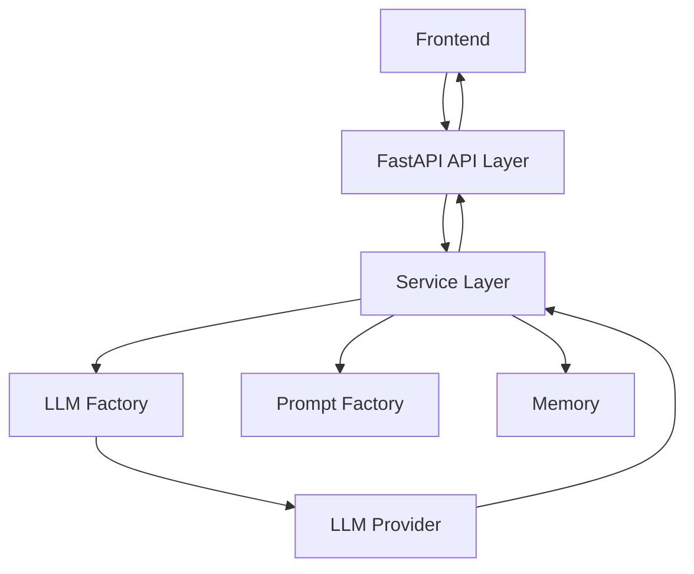

# Backend – FastAPI (llm/backend)

## Architecture Overview
The backend is a modular FastAPI application structured for clarity and extensibility. It exposes REST endpoints for chat, manages business logic, and abstracts LLM provider integration.

### Key Layers
- **API Layer (`api/`)**: Handles HTTP requests/responses, validation, and routing.
- **Service Layer (`services/`)**: Contains business logic, orchestrates LLM calls, manages memory.
- **Core Modules (`core/`)**: Implements LLM provider abstraction, prompt building, and memory management.

## Request/Response Flow


## Folder Structure
```
backend/
└── app/
    ├── api/
    │   └── chat.py         # API endpoints
    ├── core/
    │   ├── llm_factory.py  # LLM abstraction
    │   ├── memory.py       # Conversation memory
    │   └── prompt_factory.py # Prompt construction
    ├── services/
    │   └── chat_service.py # Business logic
    ├── main.py             # FastAPI entrypoint
    └── schemas.py          # Pydantic models
```

## Environment Setup
```bash
# 1. Create virtual environment
python -m venv .venv

# 2. Activate (Windows)
.venv\Scripts\activate

# 3. Install dependencies
pip install -r requirements.txt
```

## Running the Backend
```bash
uvicorn app.main:app --reload
```

## API Endpoint
- **POST /chat**
    - Request: `{ "message": "...", "model": "...", "temperature": 0.7, ... }`
    - Response: `{ "response": "..." }`

## LLM Abstraction
The LLM Factory (`core/llm_factory.py`) selects the provider (Groq, OpenAI, etc.) at runtime. Add new providers by extending this module.

## Local vs Non-Local LLM APIs
The backend supports both local (Ollama) and non-local/cloud (Groq) LLM providers. This allows you to test and compare:
- **Ollama:** Run LLMs locally for privacy and offline use
- **Groq:** Use a cloud API for scalable, managed inference
Switch providers via configuration or API parameters.
